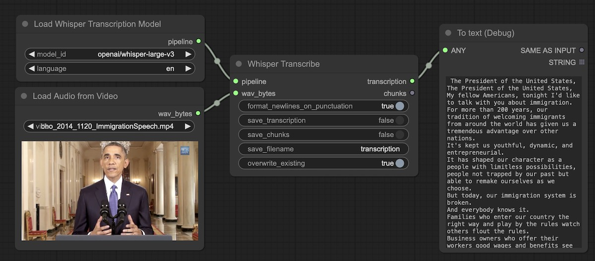

# ComfyUI Transcription Tools

This package provides custom nodes for ComfyUI to perform transcription tasks on audio and video file inputs. Well suited for long duration inputs. Includes multi-language support and batch processing of many files at once.

Note: To text (Debug) is part of [Derfuu_ModdedNodes](https://github.com/Derfuu/Derfuu_ComfyUI_ModdedNodes).

## Documentation

[Example Workflows](docs/workflows.md)

[Node Info](docs/nodes.md)

[Supported Transcription Models](docs/models.md)

## Special Thanks

The team supporting [ComfyUI-VideoHelperSuite](https://github.com/Kosinkadink/ComfyUI-VideoHelperSuite) which provided insrumental examples in the development of this tool.
