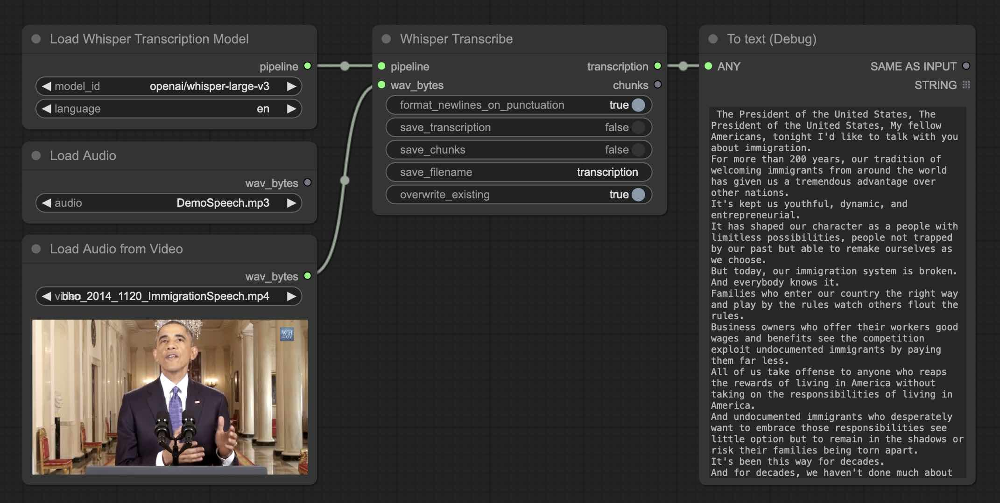
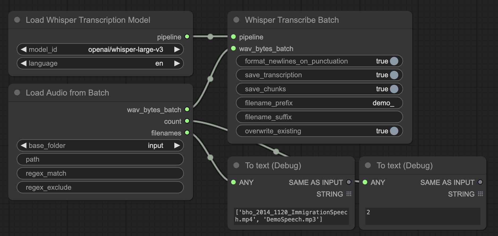

# Workflows

## Single Transcribe

Loads audio or video files from the `input/` folder. Saves the transcription to the `output/transcriptions` folder.

[single_transcribe.json](../workflows/single_transcribe.json)

## Batch Transcribe

Loads audio and video files from the selected folder. Folders may be selected relative to the `input/` or the system root. Saves the transcriptions to the `output/transcriptions` folder.

[batch_transcribe.json](../workflows/batch_transcribe.json)

